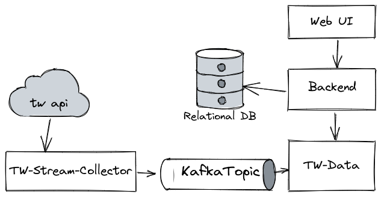

## SMA - Social Media Aggregator - Sample data streaming application
 
- ### [Demo - https://sma.dlj.freemyip.com/](https://sma.dlj.freemyip.com/)

- ### In this repo 
  - [Frontend](web-ui) - Rust(Wasm) + Html/CSS
  - [Backend](backend) - Kotlin + SpringBoot + RDBMS + Rest API
  - [Twitter data worker](tw-data) - Kotlin + Kafka + Grpc + LMDB
  - [Twitter stream collector](tw-stream-collector) - Kotlin + Twitter API
  - [Deployment](deployment) - Docker + Docker compose + Git hook based pipeline
 

